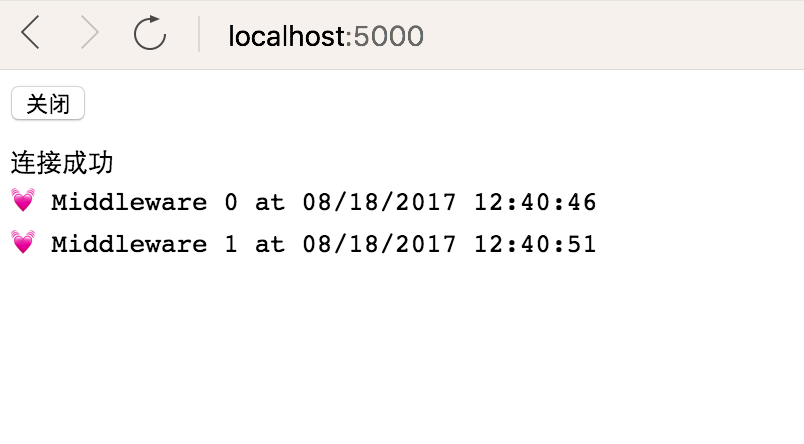

# 简介
浏览器与服务器通讯模型，你可能听说过Comet, Ajax推送, 反向Ajax, HTTP流，WebSockets与SSE等服务器推送技术。服务器推送最大的优势是低延迟，HTML5 Server Send Events就是其中一种技术。HTML5的Web Sockets也能推送数据到客户端，但是相对SSE，Web Sockets的是基于更复杂的服务端技术，具有全双工socket通讯功能, 服务端能推送数据到客户端，客户端也能推送数据回服务端。SSE工作现有HTTP/HTTPS协议下，支持代理服务器与认证技术。SSE是文本协议你能轻易的调试它。如果你需要发送大部二进制数据从服务端到客户端，或者客户端与服务端有复杂的交互WebSocket是更好的选择。

本示例演示了客户端浏览器使用HTML5 EventSource从服务器获取数据。  
EventSource 接口用于接收服务器发送的事件。它通过HTTP连接到一个服务器，以text/event-stream 格式接收事件, 不关闭连接。


# 环境
* .Net Core 2.0 Release
* Chrome 60

# 运行
```
git clone https://github.com/scfido/serversendevents.git
cd serversendevents
dotnet restore
dotnet run
```

浏览器打开http://localhost:5000/


可以看到浏览器在不刷新连接的前提下，隔一段时间就会收到服务端推送来的信息。


# 参考
* [HTML5的Server-Sent Events介绍](http://www.cnblogs.com/wintersun/archive/2014/05/18/3735160.html)